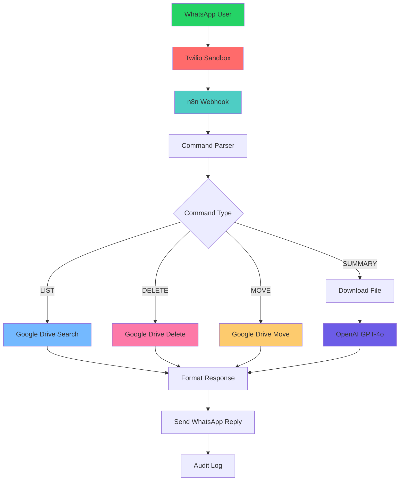

# 🤖 n8n WhatsApp Google Drive Assistant

[](https://www.docker.com/)
[](https://n8n.io/)
[](https://www.whatsapp.com/)
[](https://drive.google.com/)
[](https://openai.com/)

> **Automate your Google Drive operations through WhatsApp messages with AI-powered document summarization**

Transform your smartphone into a powerful Google Drive management tool! Send simple WhatsApp messages to list files, delete documents, move folders, and get AI-generated summaries of your documents.

## ✨ Features

### 📱 **WhatsApp Commands**
- **`LIST /ProjectX`** → List all files in a folder
- **`DELETE /ProjectX/report.pdf`** → Safely delete specific files  
- **`MOVE /ProjectX/report.pdf /Archive`** → Move files between folders
- **`SUMMARY /ProjectX`** → Get AI-powered document summaries

### 🛡️ **Security & Safety**
- OAuth2 authentication for Google Drive
- Comprehensive audit logging
- Safety guards against mass deletion
- Encrypted credential storage
- Confirmation workflows for destructive operations

### 🧠 **AI Integration**
- OpenAI GPT-4o for intelligent document analysis
- Support for PDF, DOCX, and TXT files
- Contextual summaries with key insights
- Multi-language document processing

### 🚀 **Production Ready**
- Docker containerization
- Health checks and monitoring
- Horizontal scaling support
- Comprehensive logging
- Easy backup and restore

## 🎯 Use Cases

- **📊 Project Management**: Quickly check project files and reports
- **📝 Document Review**: Get instant summaries of lengthy documents
- **🗂️ File Organization**: Move and organize files without opening Drive
- **📱 Mobile Access**: Manage your Drive when away from computer
- **👥 Team Collaboration**: Share file statuses through WhatsApp
- **📋 Audit Trails**: Track all file operations automatically

## 🏗️ Architecture



## 🚀 Quick Start

### Prerequisites
- Docker & Docker Compose installed
- Twilio account (free sandbox available)
- Google Cloud project with Drive API enabled
- OpenAI API key

### 1-Minute Setup
```bash
# Clone the repository
git clone https://github.com/yourusername/n8n-whatsapp-gdrive
cd n8n-whatsapp-gdrive

# Run automated setup
./setup.sh
```

That's it! The script will:
- ✅ Check your system requirements
- ✅ Guide you through API credential setup
- ✅ Start all services automatically
- ✅ Import the workflow
- ✅ Provide testing instructions

## 📋 System Requirements

| Component | Minimum | Recommended |
|-----------|---------|-------------|
| **CPU** | 2 cores | 4+ cores |
| **RAM** | 4GB | 8GB+ |
| **Storage** | 10GB | 20GB+ |
| **Docker** | 20.10.0+ | Latest |
| **OS** | Ubuntu 20.04+<br/>macOS 10.15+<br/>Windows 10/11 + WSL2 | Latest LTS |

## 🔧 Configuration

### API Credentials Needed

1. **Twilio WhatsApp Sandbox** (Free)
   - Account SID
   - Auth Token
   - Sandbox phone number

2. **Google Drive OAuth2**
   - Client ID
   - Client Secret
   - Enabled Drive API

3. **OpenAI API**
   - API key with GPT-4o access

4. **WhatsApp Business API** (Optional, for production)
   - Access token
   - Business account ID

### Environment Setup
```bash
# Copy environment template
cp .env.example .env

# Edit with your credentials
nano .env
```

## 📱 Usage Examples

### Basic Operations
```
LIST /Work/2024
→ "Found 15 files:
   1. Q1_Report.pdf
   2. Budget_Analysis.xlsx
   3. Meeting_Notes.docx
   ..."

DELETE /Work/2024/Old_Draft.pdf
→ "File has been deleted successfully."

MOVE /Work/2024/Final_Report.pdf /Archive/2024
→ "File has been moved successfully."
```

### AI Summarization
```
SUMMARY /Work/2024/Q1_Report.pdf
→ "Document Summary:
   • Q1 revenue increased 23% compared to last year
   • Key growth drivers: digital transformation initiatives
   • Challenges: supply chain disruptions in March
   • Outlook: Positive trajectory expected for Q2"
```

## 🛡️ Security Features

### Data Protection
- **End-to-end encryption** of credentials
- **OAuth2 secure authentication** 
- **No credential storage** in workflow JSON
- **Audit logging** of all operations
- **Rate limiting** to prevent abuse

### Safety Measures
- **Confirmation required** for DELETE operations
- **Path validation** to prevent unauthorized access
- **Permission checks** before file operations
- **Error handling** with graceful degradation

## 📊 Monitoring & Logging

### Built-in Monitoring
```bash
# View service status
docker compose ps

# Check logs
docker compose logs -f n8n

# Monitor resource usage
docker stats
```

### Audit Trail
All operations are logged with:
- Timestamp
- User phone number
- Action performed
- File paths
- Success/failure status
- Response time

## 🔄 Backup & Restore

### Automated Backup
```bash
# Create backup
./backup.sh

# Restore from backup
./restore.sh backup_20240806_143022.tar.gz
```

### Manual Backup
```bash
# Backup n8n data
docker run --rm -v n8n_data:/data -v $(pwd):/backup alpine   tar czf /backup/n8n_backup_$(date +%Y%m%d_%H%M%S).tar.gz -C /data .
```

## 🐛 Troubleshooting

### Common Issues

| Issue | Solution |
|-------|----------|
| **Port 5678 in use** | Change port in `docker-compose.yml` |
| **Webhook not receiving** | Check firewall, use ngrok for testing |
| **Google auth fails** | Verify OAuth2 credentials & redirect URI |
| **Out of memory** | Increase Docker memory limit |
| **Workflow import fails** | Check n8n version compatibility |

### Debug Mode
```bash
# Enable debug logging
export N8N_LOG_LEVEL=debug
docker compose up -d

# View detailed logs
docker compose logs -f n8n | grep DEBUG
```

## 🚀 Deployment Options

### Development
```bash
# Local development with hot reload
docker compose -f docker-compose.dev.yml up
```

### Production
```bash
# Production with SSL and external database
docker compose -f docker-compose.prod.yml up -d
```

### Cloud Deployment
- **AWS ECS/Fargate**: Use provided CloudFormation template
- **Google Cloud Run**: Container-ready configuration
- **Azure Container Instances**: ARM template included
- **Kubernetes**: Helm charts available

## 🔧 Customization

### Adding New Commands
1. Edit the `Parse Command` node in n8n
2. Add new conditional branches
3. Implement Google Drive operation
4. Update response formatter

### Custom AI Models
- Replace OpenAI with Anthropic Claude
- Add support for local LLMs
- Implement custom summarization logic

### Integration Extensions
- Add Slack notifications
- Integrate with CRM systems
- Connect to other cloud storage

## 📈 Performance Optimization

### Scaling Options
- **Horizontal scaling**: Multiple n8n instances
- **Database optimization**: External PostgreSQL
- **Caching**: Redis for better performance
- **CDN**: Static asset caching

### Resource Optimization
```bash
# Optimize for low-memory systems
export N8N_DISABLE_METRICS=true
export NODE_OPTIONS="--max-old-space-size=2048"
```

## 🤝 Contributing

We welcome contributions! Please see our [Contributing Guide](CONTRIBUTING.md) for details.

### Development Setup
```bash
# Fork the repository
git fork https://github.com/original/n8n-whatsapp-gdrive

# Create feature branch
git checkout -b feature/amazing-feature

# Make changes and test
npm test

# Submit pull request
```

## 📄 License

This project is licensed under the MIT License - see the [LICENSE](LICENSE) file for details.

## 🙏 Acknowledgments

- [n8n.io](https://n8n.io) for the amazing automation platform
- [Twilio](https://twilio.com) for WhatsApp API access
- [OpenAI](https://openai.com) for GPT-4o capabilities
- [Google](https://developers.google.com) for Drive API

## 📞 Support

- 📖 [Documentation](docs/)
- 💬 [Discord Community](https://discord.gg/n8n)
- 🐛 [Issue Tracker](https://github.com/yourusername/n8n-whatsapp-gdrive/issues)
- 📧 [Email Support](mailto:support@example.com)

## 🗺️ Roadmap

### v1.1 (Next Release)
- [ ] WhatsApp Business API integration
- [ ] File upload via WhatsApp
- [ ] Advanced search filters
- [ ] Multi-language support

### v1.2 (Future)
- [ ] Voice message transcription
- [ ] Image OCR and analysis
- [ ] Integration with Microsoft 365
- [ ] Advanced analytics dashboard

### v2.0 (Long-term)
- [ ] Multi-tenant support
- [ ] Custom workflow builder UI
- [ ] Enterprise SSO integration
- [ ] Advanced AI features

---

<div align="center">

**⭐ Star this repository if you find it useful!**

Made with ❤️ by the n8n Community

[Report Bug](https://github.com/yourusername/n8n-whatsapp-gdrive/issues) • [Request Feature](https://github.com/yourusername/n8n-whatsapp-gdrive/issues) • [Documentation](docs/)

</div>
