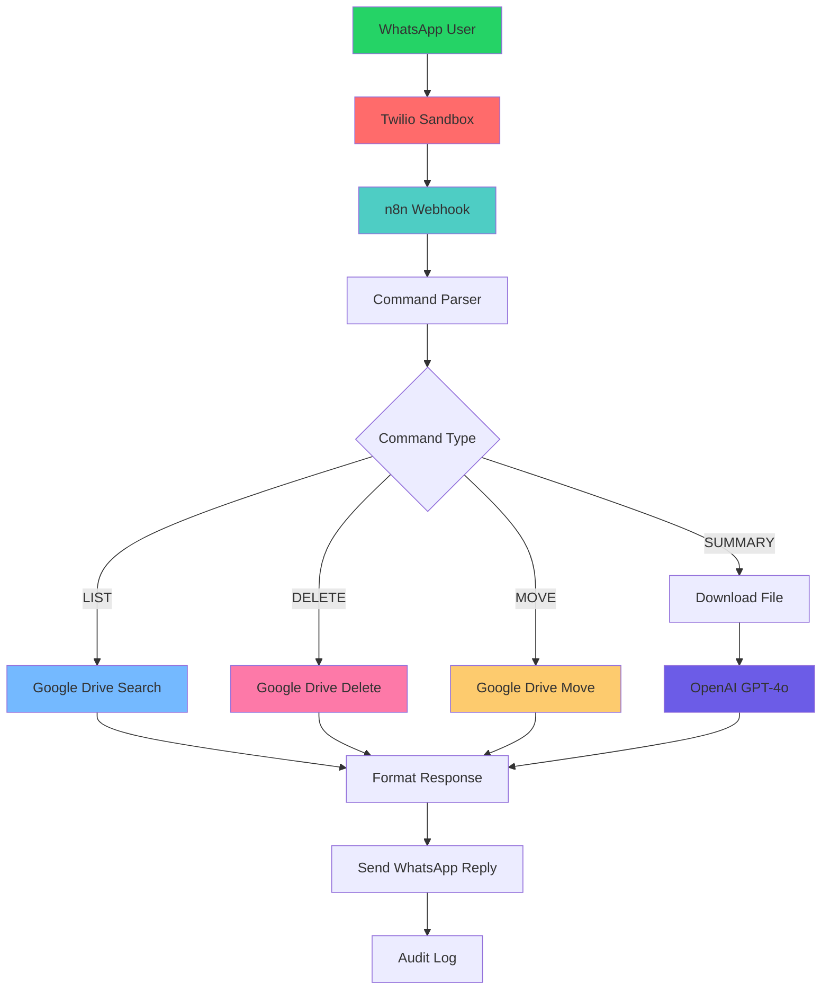

## ✨ Features

### 📱 **WhatsApp Commands**
- **`LIST /ProjectX`** → List all files in a folder
- **`DELETE /ProjectX/report.pdf`** → Safely delete specific files  
- **`MOVE /ProjectX/report.pdf /Archive`** → Move files between folders
- **`SUMMARY /ProjectX`** → Get AI-powered document summaries

### 🛡️ **Security & Safety**
- OAuth2 authentication for Google Drive
- Comprehensive audit logging
- Safety guards against mass deletion
- Encrypted credential storage
- Confirmation workflows for destructive operations

### 🧠 **AI Integration**
- OpenAI GPT-4o for intelligent document analysis
- Support for PDF, DOCX, and TXT files
- Contextual summaries with key insights
- Multi-language document processing

### 🚀 **Production Ready**
- Docker containerization
- Health checks and monitoring
- Horizontal scaling support
- Comprehensive logging
- Easy backup and restore

## 🎯 Use Cases

- **📊 Project Management**: Quickly check project files and reports
- **📝 Document Review**: Get instant summaries of lengthy documents
- **🗂️ File Organization**: Move and organize files without opening Drive
- **📱 Mobile Access**: Manage your Drive when away from computer
- **👥 Team Collaboration**: Share file statuses through WhatsApp
- **📋 Audit Trails**: Track all file operations automatically

## 🏗️ Architecture



## 🚀 Quick Start

### Prerequisites
- Docker & Docker Compose installed
- Twilio account (free sandbox available)
- Google Cloud project with Drive API enabled
- OpenAI API key

### 1-Minute Setup
```bash
# Clone the repository
git clone https://github.com/yourusername/n8n-whatsapp-gdrive
cd n8n-whatsapp-gdrive

# Run automated setup
./setup.sh
```

That's it! The script will:
- ✅ Check your system requirements
- ✅ Guide you through API credential setup
- ✅ Start all services automatically
- ✅ Import the workflow
- ✅ Provide testing instructions


## 🔧 Configuration

### API Credentials Needed

1. **Twilio WhatsApp Sandbox** (Free)
   - Account SID
   - Auth Token
   - Sandbox phone number

2. **Google Drive OAuth2**
   - Client ID
   - Client Secret
   - Enabled Drive API

3. **OpenAI API**
   - API key with GPT-4o access

4. **WhatsApp Business API** (Optional, for production)
   - Access token
   - Business account ID

### Environment Setup
```bash
# Copy environment template
cp .env.example .env

# Edit with your credentials
nano .env
```

